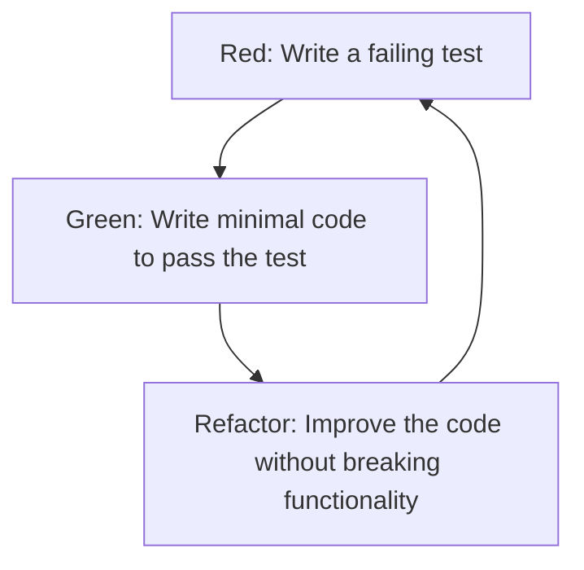
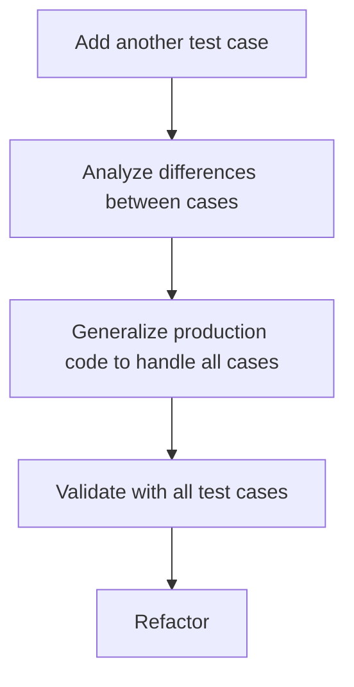
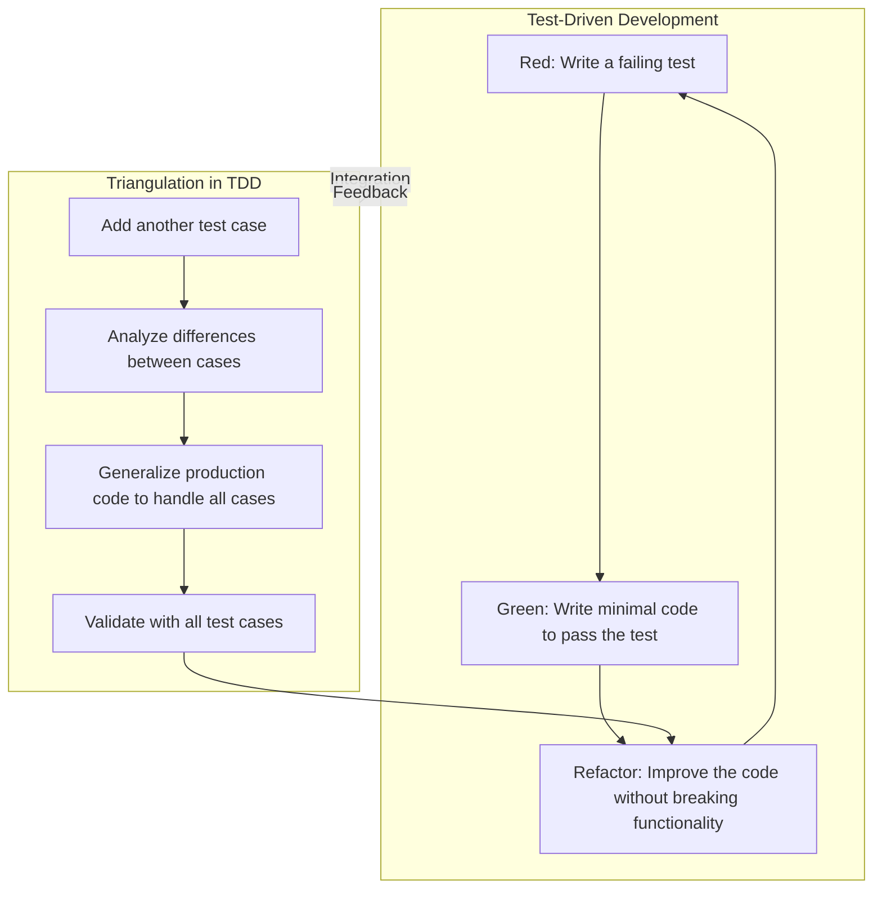

# TDD Demo

This project contains a simple demo to explain the core concepts of Test Driven Development (TDD). The core concepts
are 

1. **Production Code Driven by Tests**  
You should only write production code in direct response to a failing test. No production code should exist without a 
corresponding test-driving its necessity.

2. **Minimalist Production Code**  
When implementing production code, write only the code required to make the failing test pass. 
Avoid adding functionality beyond what is immediately necessary to satisfy the test's requirements. Use the concept
of **triangulation** for further refinement of implemented functionality.

3. **Purposeful Test Design**
Tests should be written with the specific intent of identifying the absence of required functionality. Only write
enough of the test to ensure it fails for the correct reason, clearly indicating what needs to be implemented 
in the production code.

This results in the following development process for every iteration:

Together with the concept of triangulation in Test-Driven Development: 

Results in the following over-all interrelated development cycle for TDD

# Disclaimer

This repository contains a sample file and a sample test for the FizzBuzz problem. Despite being publicly available,
this repository is not licensed for use, modification, or distribution beyond the scope of personal reference and
educational purposes.

## Important Notes:

1. No License:
   - The content of this repository is provided “as-is” without any explicit or implicit licence.
   - The FizzBuzz problem and any code related to it can be seen as common knowledge.

2. No Guarantee or Warranty:
   - This repository comes with no guarantees regarding the accuracy, completeness, functionality, 
   or fitness for any particular purpose. 
   - Use of this repository and its contents is entirely at your own risk.

3. Example Content:
   - The files provided here, including the sample FizzBuzz implementation and test, are for demonstration purposes 
   only.
   - These are not intended for use in production systems or critical environments.

4. Legal Liability:
   - The repository owner assumes no responsibility or liability for any consequences, direct or indirect, resulting 
   from the use or misuse of the content provided.

By accessing this repository, you acknowledge and agree to these terms. If you do not agree, please refrain from using
or referencing this repository.